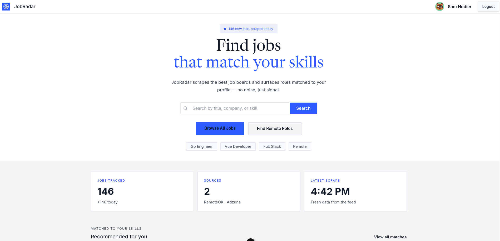

<!-- markdownlint-disable MD013 -->

# JobRadar — a self-hosted job search command center

JobRadar aggregates job listings from multiple sources into one place, scores each one against your profile with AI, and helps you track every application from *saved* to *offer*.



## Motivation

Finding a tech job right now is hard, and the tools meant to help are working against you. Every platform is walled off, so the same role gets posted in five places and you have no single feed to watch — some sites actively gatekeep listings to keep you logged in to *their* product. I wanted one place where jobs from many sources are pulled together, and then I wanted the machine to do the tedious parts: score how well each role fits my profile, draft a tailored resume for the ones worth applying to, and notify me when something is a genuinely strong match. You can also paste a link to a job you found yourself and get the same treatment, so JobRadar works even for roles outside its own feed.

I started building it to sharpen my own skills and to actually use it in my own search — most of the alternatives I found were terminal-only or did one slice of the problem. After showing it to a few friends who are also job hunting, they wanted in too. So it ended up being a win for me and for them.

## Tech Stack

- **Backend:** Go, Chi router, SQLC, pgx
- **Database:** PostgreSQL (core data), Redis (sessions and job queue)
- **Frontend:** Vue 3, TypeScript, Vite, Pinia, Vue Router
- **Infrastructure:** Docker Compose

## Features

- **Job aggregation** — automated fetching from multiple sources (RemoteOK, Adzuna) into a single feed.
- **AI matching** — every job is scored against your profile by an algorithmic pass (Jaro-Winkler title similarity, Aho-Corasick skill matching) that produces a match score and matched/missing skills, fast and at no API cost. An LLM enrichment pass for high scorers is in progress (see below).
- **Resume profile** — a structured resume builder (work history, achievements, skills, education, projects) that powers matching and resume generation.
- **Application tracking** — a Kanban board to manage applications from saved through offer, with notes and follow-up dates.
- **Background worker engine** — a Redis-backed job queue with worker goroutines, graceful shutdown, exponential backoff, and a dead-letter queue.
- **Authentication** — GitHub OAuth with Redis-backed sessions and HttpOnly cookies.

### Planned

- AI-generated tailored resumes delivered by email for high-match jobs.
- Email and in-app notifications when a strong match appears.
- Paste-a-link import for jobs found outside JobRadar's feed.
- More sources, including a Greenhouse / Ashby / Lever portal scanner.

## Quick Start

### Prerequisites

- Docker and Docker Compose
- Go 1.25+
- Node.js 20+
- [`goose`](https://github.com/pressly/goose) for database migrations

### Steps to run

1. **Clone the repository:**

   ```bash
   git clone https://github.com/samnodier/jobradar.git
   cd jobradar
   ```

2. **Set up environment variables.** Copy the example file and fill in your database credentials and GitHub OAuth app keys:

   ```bash
   cp .env.example .env
   ```

3. **Start Postgres and Redis:**

   ```bash
   make up
   ```

4. **Run database migrations:**

   ```bash
   make migrate-up
   ```

5. **Run the backend:**

   ```bash
   make run
   ```

6. **Run the frontend** (in a second terminal):

   ```bash
   cd frontend
   npm install
   npm run dev
   ```

The backend runs on <http://localhost:8080> and the frontend on <http://localhost:5173>.

## Usage

JobRadar is split into a Go backend (API plus background workers) and a Vue frontend. Day to day, you interact with it through the web app, but the engine underneath is worth knowing.

### How matching works

Matching runs in two stages — fast and free first, expensive and smart only where it pays off:

1. **Algorithmic pass (every job).** Jaro-Winkler similarity on titles, Aho-Corasick multi-pattern matching on skills, and token sorting to handle swapped word order. This produces a `match_score`, `matched_skills`, and `missing_skills` with no API cost.
2. **LLM enrichment (high scorers only) — in progress.** Jobs that clear a threshold will be enqueued for an LLM pass that adds a one-line summary and semantic validation. Provider is Gemini, using a user-supplied API key.

### The worker engine

New jobs are scraped on an interval (`SCRAPE_INTERVAL`, default 6h). For each new job, the scraper fans out one match job per registered user onto a Redis queue. Worker goroutines pull from the queue with a blocking pop (`BRPOP`), score the job, and write the result. Failed jobs retry with exponential backoff and land in a dead-letter queue after the final attempt.

### Useful Make targets

- `make up` / `make down` — start / stop Postgres and Redis
- `make run` — run the backend
- `make migrate-up` / `make migrate-down` — apply / roll back database migrations
- `make sqlc` — regenerate type-safe Go from SQL queries
- `make test` — run the Go test suite
- `make exec` — open a `psql` shell in the database container

### Configuration

Configuration is via environment variables (see `.env.example`):

- `PORT` — backend port (default `8080`)
- `DB_URL` — Postgres connection string used by migrations
- `GITHUB_CLIENT_ID` / `GITHUB_CLIENT_SECRET` / `GITHUB_REDIRECT_URL` — GitHub OAuth app credentials
- `SESSION_TTL` — session lifetime (default `240h`)
- `ONBOARDING_TTL` — pending-signup lifetime (default `10m`)
- `SCRAPE_INTERVAL` — how often the scheduler scrapes new jobs (default `6h`)
- `REDIS_ADDR` — Redis address (default `localhost:6379`)
- `ALLOWED_ORIGINS` — comma-separated CORS allowlist

## Contributing

JobRadar is primarily a personal project, but issues and suggestions are welcome. If you want to contribute, open an issue first to discuss the change.
